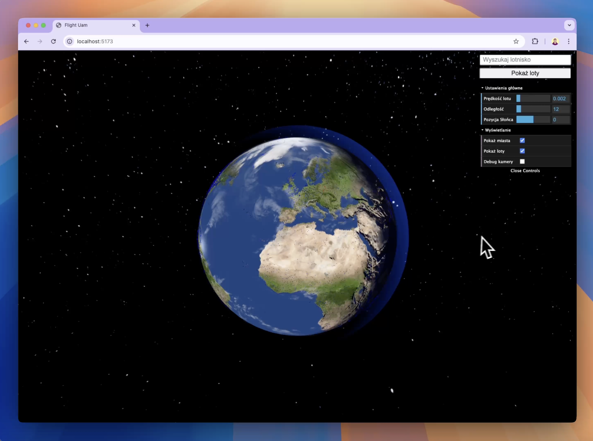
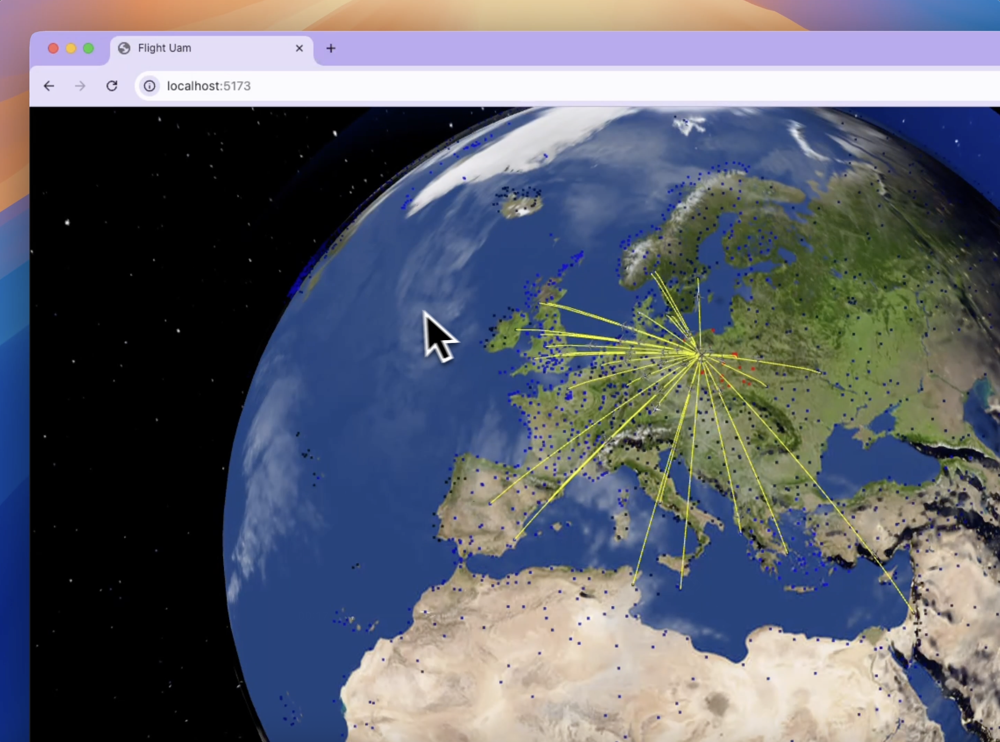

# Europejska Sieć Połączeń Lotniczych 🌍✈️

Aplikacja edukacyjna 3D, która wizualizuje bezpośrednie połączenia lotnicze w Europie. Użytkownik może wybrać lotnisko (miasto), a następnie zobaczyć wszystkie powiązane trasy jako trójwymiarowe łuki ortodromiczne z animowanymi samolotami poruszającymi się po tych trasach.

## 🎯 Cel projektu

- Zwizualizowanie połączeń lotniczych w Europie w atrakcyjny i intuicyjny sposób.
- Animacja samolotów lecących wzdłuż ortodrom (najkrótszych tras po powierzchni kuli).
- Zastosowanie nowoczesnych technik grafiki komputerowej do edukacyjnej eksploracji sieci transportowej.

## 🧠 Techniki grafiki komputerowej (GK)

- ✅ Układy współrzędnych **Parallel Transport Frames (PTF)** – zapewniają płynną orientację samolotu wzdłuż trasy.
- ✅ Generowanie krzywych/łuków (interpolacja ortodrom przy pomocy krzywych Catmull-Roma).
- ✅ Mapowanie tekstur (tekstura planety).
- ✅ Proste mapowanie cieni i świateł.
- ✅ Przetwarzanie danych geograficznych (lotniska, trasy).

## 📦 Jak zainstalować i uruchomić

### Wymagania

- Node.js i npm




### Instalacja i uruchomienie

```bash
# Zainstaluj dependencies
npm install 

# Uruchom
npx vite

